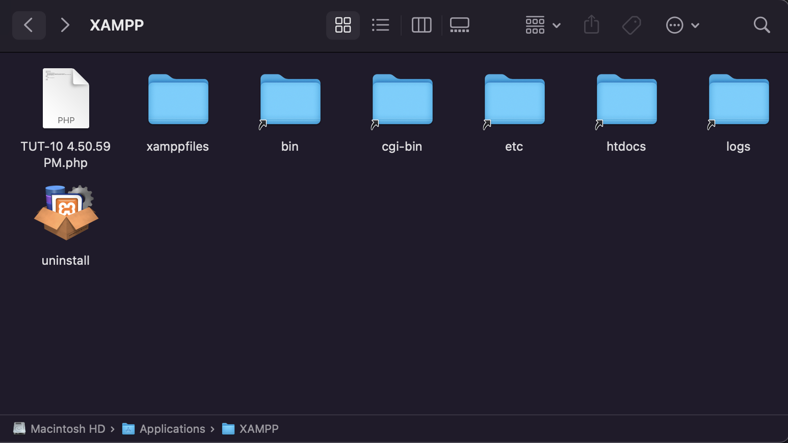

# Responsive Grocery Store Website

The following is the HTML, CSS, JS and PHP code for a responsive online grocery store website. This project was done as a team project academic assignment, and the following code is what I was responsible of, which explains why the website is not fully complete and the reason behind some missing functionilities. The website consists of one aisle and its code can be extended to accomodate extra departments. The website has four main pages: the homepage (or the aisle page), the product page, the login page and the sign up page.

## 1. Setting up and running the webpage

### 1.1 Installing XAMPP:

The webpage is run by initializing a local Apache server using XAMPP. Note that the server being run is only a local rserver, meaning the webpage can be accessed only from a local web browser after starting the server.
It is recommended to download the latest XAMPP version for your computer. However, the latest version might not work depending on the computer's architecture. You should try different versions of the application and figure out which one runs for you. The 7.4.21 version is the right version for mac M1 users.

Link for XAMPP installation: https://sourceforge.net/projects/xampp/files/XAMPP%20Mac%20OS%20X/

### 1.2. Running XAMPP:

After the installation and configuration is complete, launch the application and head to the "Manage Servers" option, then click on "Start All".

Now that the Apache server is running on your computer, it is time to open the webpage on the browser.

### 1.3. Running the webpage in the browser:

In order to run the code on the browser with XAMPP, it is very important to note that the code must reside in the htdocs folder in the XAMPP folder. In other words, the code cannot be loaded into the browser if it the folder containing your code is on the desktop.
Find the XAMPP folder in your file system, and save the code in the htdocs folder. 

**The XAMPP folder:**

**The htdocs folder:**

**Code location:**

Next, head to your browser and type: "http://localhost/folder-name/file-name", which would be "http://localhost/Online-Grocery-Store/Aisles-page.php" in this case.

Congratulations, you have made it to the homepage!

## 2. About the website:

### 2.1. The homepage:

As mentionned before, the website is responsive, and the layout changes depending on the user's screen size. This feature was done using css (the code responsible of the responsiveness is at the end of each css file). Here's an example.

**Layout on an iPhone 8:**

**Layout on an iPad:**

**As you can see, the homepage consists of navbar, a search bar, the body and the footer:**

1. The navbar and the footer are unified on all the other pages of the website:
The home link takes you to the Aisles page (the homepage), the cart button has no functionality, the user button takes you to login page.
Links in the footer has no functionality.
2. The search bar has no functionality.
3. The body consists of the aisle items. For the purpose of making things simple, selecting different options takes you to one and only one product page, the banana page. This can be easily changed, of course.

### 2.2. The product page:

The product page consists of the product image, the product price depending on the user preference (by pound or unit).

The quantity is initially set to 0. When the user selects an option, the price gets calculated accordingly with the selected options, and it gets displayed to the RHS of the screen. This functionality was implemented using JS. The add to cart button works but it has no functionaility, the back to the fruit aisle button takes you back to the homepage.

**Price with the by unit option:**

**Price with the by weight option:**

**The product description is a button that, once toggled, shows the description of the current item.**

### 2.3. The login page:

The login page can be accessed with the user button on the top right corner of the screen. User credentials are saved within the project file in an XML document, and initially the user credentials made to test the functionality are "admin" for username, and "admin" for password. 

**User does not exist in Database:**

**User exists but incorrect password:**

**User exists and correct password:**

Once you login with the correct credentials, it will take you back to the homepage with displaying a welcome back message followed by the user name. There is also a logout button that pops up in the navbar that basically allows you to close your session. Once you click the logout button, the session gets destroyed and the welcome back message and the button disappear.

### 2.4. The sign up page:

This page can be accessed with the sign up button in the login page. There is no restrictions on the email format. However, you cannot sign up with a username or an email that already exists, and the passwords should match (case sensitive).

**Username already taken:**

**Passwords don't match:**

**Valid input:**

A valid input creates an XML file with the credentials, and takes you to the login page. 

A login with the correct input will take you to the homepage, displaying the welcome back message with the relative username and the logout button.

## 3. The end:

If you made it here, then you should know by now what the website does, pull the code and try it out yourself to understand how it does it. Thank you for taking the time to check it out nad I hope that you find it helpful for you.

System.exit(0)

